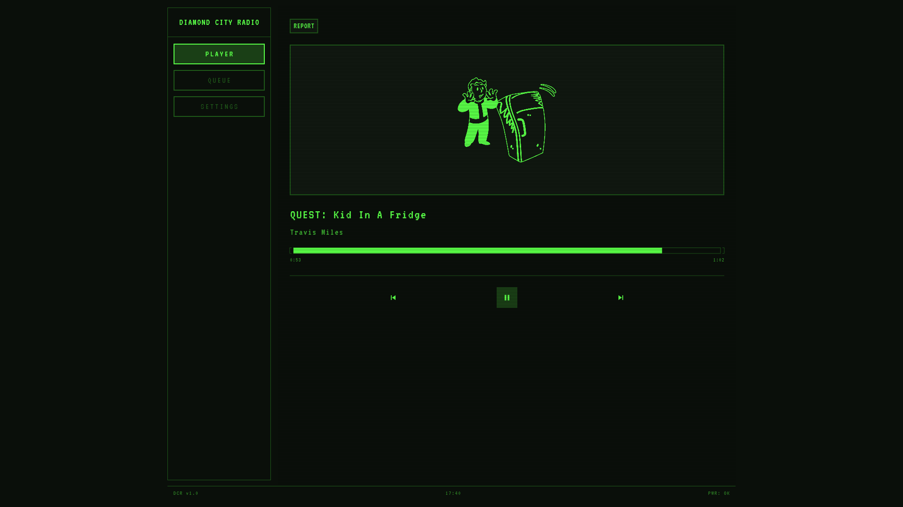
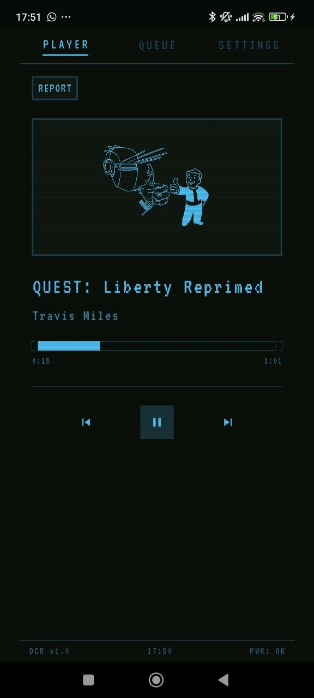

# Diamond City Radio

Diamond City Radio is a Flutter app that recreates a Pip-Boy-style radio player inspired by Fallout 4.

The app loads songs and DJ reports from local JSON data, builds rotating radio sets, and plays them with:
- Intro and outro clips around songs
- Interleaved report clips
- Queue view and now-playing view
- Settings for display color, scanlines, scanline animation, and audio volumes
- Desktop and mobile layouts

## Important Repository Note

Audio files are not included in this Git repository.

You must provide your own local audio assets and data JSON files in the expected asset paths (for example under `assets/audio/...` and `assets/data/...`) for playback to work.

## Requirements

- Flutter SDK (stable)
- Dart SDK (bundled with Flutter)
- Chrome (for web run target)

## Install

```bash
flutter pub get
```

## Run

Run on Chrome:

```bash
flutter run -d chrome
```

Run on a connected device/emulator:

```bash
flutter run
```

## Build

Web build:

```bash
flutter build web
```

Android build:

```bash
flutter build apk
```

## Docker Compose

Build and run the web release container:

```bash
docker compose up --build
```

Run in detached mode:

```bash
docker compose up --build -d
```

Stop the container:

```bash
docker compose down
```

Open in browser:

```text
http://localhost:11120
```

## Screenshots

<p align="center">
  
</p>
<p align="center"><em>Figure 1. Desktop UI</em></p>

<p align="center">
  
</p>
<p align="center"><em>Figure 2. Mobile UI</em></p>
